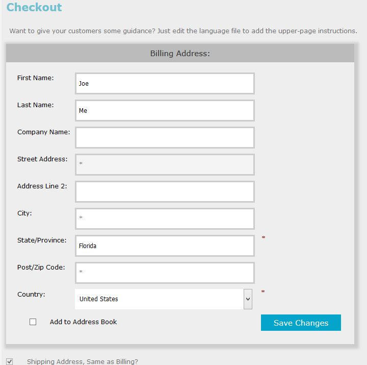
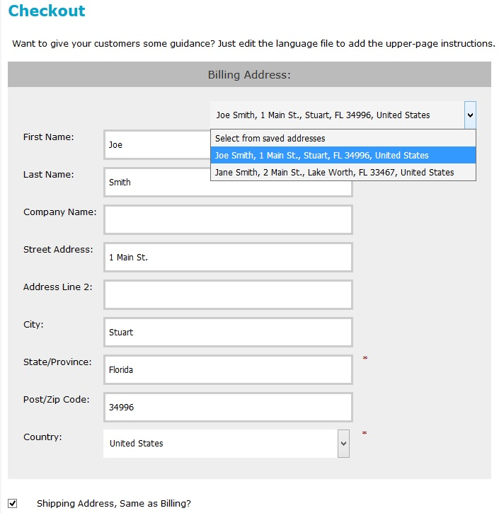

# *Checkout One* Page #

*OPC-GC/RA*'s `checkout_one` page guides a customer through the checkout process using jQuery and AJAX handlers.  The majority of this page's display is documented in the plugin's readme; this section identifies the changes specific to the support for guest-checkout and temporary addresses. 

## Gathering Contact Information ##

When a *guest-customer* starts the checkout process, the first step is to gather some *contact information*.  The `checkout_one` page's jQuery gives focus to the "Contact Information" block, requiring that the customer supply this information before proceeding.

----------

----------

There are a couple of optional elements displayed with this block:

1. ***Confirm Email***.  Displayed when the store has set the *OPC*'s configuration setting **Guest Checkout: Require Email Confirmation?** to *true*.
1. ***Date of Birth***.  Displayed when the store has set **Configuration->Customer Details->Date of Birth** to *true*.

## Updating Addresses (Billing and Shipping) ##

The address-gathering within the page has been updated for v2.0.0, now displaying a full address form when an order's billing and/or shipping addresses are changed.  That display changes depending on the [mode](address_management.md) in which the checkout is being processed.

### Guest Checkout ###

For a guest-checkout, once the customer has supplied their **Contact Information**, the **Billing Address** block is given focus.  Since the customer has no saved addresses &mdash; they're a *guest* &mdash; neither the saved-address dropdown nor the *Save this Address* checkbox are displayed. 

----------

----------

### Registered-Account Checkout ###

When a *registered-account* customer enters the checkout process, the first step is to collect the billing- and shipping-address to be used for the order &hellip; so the **Billing Address** block is given focus.  Unlike the handling for guest-checkout, the customer is given the opportunity to save the entered address(es) in their *Address Book*.

***Note***:  When a *registered-account* customer chooses to *Add to Address Book*, the first address they save is registered as their "Primary Address".

----------

----------

### Full-Account Checkout ###

When a customer with a full-account (i.e. they've saved at least one address to their *Address Book*) enters the checkout process, their "Primary Address" is initially displayed in the **Billing Address** block.  The top of the address-gathering form includes a drop-down selection of their current *Address Book* entries.

If the customer chooses one of the saved addresses in their *Address Book*, the form auto-submits to register any zone-related changes associated with the order.

----------

----------

If the customer chooses to use a different address, they enter that address information in the form &mdash; any changed fields are highlighted.  Upon detection of a change to an address-block, the `checkout_one` page's jQuery gives focus to that block and displays the "Add to Address Book" checkbox as well as buttons to *Cancel* or *Save Changes*.

Clicking *Cancel* results in any address changes being discarded, with the previous values displayed.  When *Save Changes* is clicked, the address is updated and stored either in the customer's *Address Book* or as a temporary address to be used only for the current order.

----------

----------